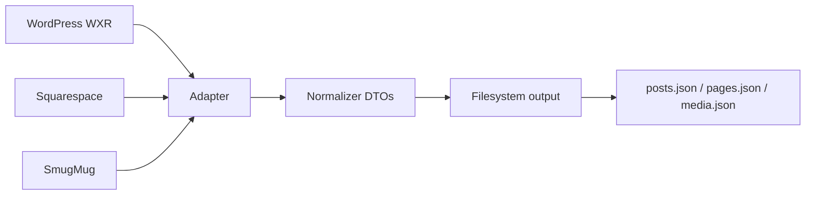
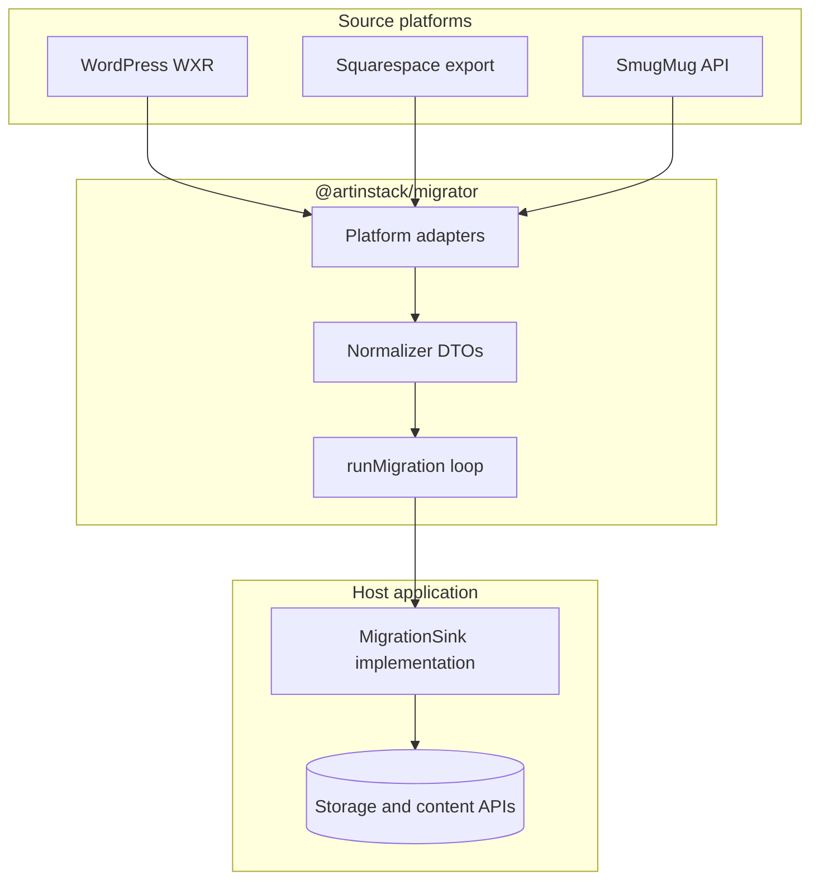

# Architecture blueprint

`@artinstack/migrator` is a **stateless, platform-agnostic** migration framework and **public OSS** project (MIT). It reads content from third-party sources (WordPress, SmugMug, Squarespace, and similar) and normalizes it into portable data transfer objects (DTOs).

The design progresses in layers: **dry-run** and **export** normalized JSON first, introduce a **`MigrationSink`** write abstraction, then let a host application implement the sink and—only when imports are proven—add jobs, queues, and UI. If normalized export is not reliable, nothing downstream matters.

Orchestration, credentials, billing, and dashboard UI stay in the host application.

---

## Goals

| Goal | Approach |
|------|----------|
| Support multiple source platforms | Isolated adapters behind one normalizer |
| Prove correctness before integration | Dry-run + JSON export to disk |
| Debug imports without side effects | Dry-run: parse, normalize, estimate storage, preview slugs and conflicts |
| Stay testable without a running backend | Adapters emit DTOs, not database rows |
| OSS contributions | Public repo + fixtures |
| Handle large imports safely | Stream assets through sinks; resume from checkpoints |
| Defer hard layout translation | HTML snapshots first; structured page trees later |

---

## Dry-run

Before any write (filesystem, sink, or host APIs), the CLI supports **`--dry-run`**: parse and normalize the full export, surface problems early, and exit without persisting content.

| Capability | Purpose |
|------------|---------|
| **Parse + normalize** | Validate export structure; build DTOs in memory |
| **Storage estimate** | Sum asset sizes (via HTTP `HEAD` where possible) for quota preview |
| **Slug preview** | List post, page, and portfolio slugs with intended public paths |
| **Conflict report** | Duplicate slugs, missing featured images, oversized media, invalid HTML, unsupported blocks |
| **Migration report** | Run summary, warnings, and errors as JSON (no writes) |

Dry-run is the recommended first step for any new export file. Host applications can reuse the same analysis before enqueueing a production job.

---

### Export path — parse and write JSON



### Sink path — parser → normalizer → host writes



The migrator **never** knows object storage, job queues, or CMS internals. It only calls `sink.createPost(...)`, `sink.createPage(...)`, and similar methods defined by the host.

Long-running production imports are orchestrated by the host (job queue + worker)—not by this package.

---

## Package layout

```
src/
  parsers/          WordPress, SmugMug, Squarespace → normalizer DTOs
  normalizer/       Canonical types + portable idempotency helpers
  cli/              artinstack-migrate
  sinks/
    filesystem.ts   Write JSON bundles to disk
    types.ts        MigrationSink interface
    run-migration.ts
    dry-run.ts      Parse, normalize, analyze — no writes
  transformers/     HtmlToGrapes, css-to-styles (later; optional)
  index.ts          Public API re-exports
fixtures/           Sample exports and golden JSON for tests
```

**Dependency rule:** no imports from web frameworks, proprietary CMS SDKs, or host-specific libraries. Host apps depend on `@artinstack/migrator`; never the reverse.

**Public OSS:** parsers and normalizer DTOs are useful beyond any single host—"export WordPress as JSON", "convert SmugMug albums", "transform Squarespace content". Host sinks, jobs, and billing remain private to each integrator.

---

## Core interfaces

### MigrationAdapter

Each source platform implements an adapter:

```ts
interface MigrationAdapter {
  platform: "wordpress" | "smugmug" | "squarespace";
  validateInput(input: unknown): ValidationResult | Promise<ValidationResult>;
  enumerateEntities(ctx: AdapterContext): AsyncIterable<NormalizedEntity>;
}
```

- **`validateInput`** — parse credentials or export files; return counts and validation issues before a run starts.
- **`enumerateEntities`** — lazy async iterator so large exports are not loaded into memory at once.

### Normalizer DTOs

Adapters emit **canonical entities**, not host-specific records:

| Entity | Purpose |
|--------|---------|
| `NormalizedPost` | Blog posts and articles |
| `NormalizedPage` | Static pages (HTML snapshot in MVP layout strategy) |
| `NormalizedAsset` | Remote file to stream into storage |
| `NormalizedPortfolio` | Gallery or album grouping |
| `NormalizedCategory` / `NormalizedTag` | Taxonomy |

Shared fields include `sourceId` (stable id from the source platform), `slug`, `title`, `contentHtml`, publish `status`, and optional SEO metadata. These types live in `src/normalizer/types.ts`.

### MigrationSink

The host implements writes:

```ts
interface MigrationSink {
  createPost(post: NormalizedPost): Promise<CreatePostResult>;
  createPage(page: NormalizedPage): Promise<CreatePageResult>;
  createPortfolio?(portfolio: NormalizedPortfolio): Promise<{ targetId: string }>;
  uploadAsset(input: UploadAssetInput): Promise<UploadAssetResult>;
  reportProgress?(progress: MigrationProgress): Promise<void>;
  findExisting?(key: EntityKey): Promise<string | undefined>;
}
```

`runMigration({ sink, entities, platform })` walks the entity stream, skips completed work when idempotency data is available, and dispatches each entity to the appropriate sink method.

---

## Source platform mapping

### WordPress (WXR) — editorial focus

| Extract | Normalized output |
|---------|-------------------|
| `item` post type `post` | `NormalizedPost` |
| `wp:post_name` | `slug` (sanitize; handle collisions with suffix or report) |
| `content:encoded` HTML | `contentHtml` (sanitized) |
| `wp:post_date` | `publishedAt` |
| Categories / tags | `NormalizedCategory`, `NormalizedTag` + slugs on post |
| Featured image attachment | `NormalizedAsset` → link on post |
| Inline `` | Resolve to assets; rewrite URLs in HTML during ingest |
| Pages (`page` post type) | `NormalizedPage` — MVP: HTML snapshot; later: structured layout |

Strip shortcodes and unsafe inline styles according to host policy during sanitization.

### SmugMug — media vault focus

| Extract | Normalized output |
|---------|-------------------|
| Folder / album hierarchy | `NormalizedPortfolio` (optional parent nesting via slug prefix) |
| Image originals via API | `NormalizedAsset` linked to portfolio |
| Captions / keywords | `caption`, tags where supported |
| EXIF/IPTC | Preserved when present in downloaded bytes |

Use a **bounded concurrency pool** (e.g. 4–8 parallel uploads) per job to respect API rate limits.

### Squarespace — pages + blog

| Extract | Normalized output |
|---------|-------------------|
| Blog posts | `NormalizedPost` (same HTML path as WordPress) |
| Static pages | `NormalizedPage` |
| Block JSON (Text, Image, Spacer, …) | Later: map to page builder components; MVP: flatten to `contentHtml` + minimal CSS |
| Galleries | `NormalizedPortfolio` + linked assets |

Squarespace exports often reference CDN URLs that require a **URL resolver** step before assets are streamed.

---

## HTML → page builder (later)

There is no reliable off-the-shelf npm package that converts arbitrary HTML exports into a full **GrapesJS-style** project tree (`content` components + detached root `styles[]`).

### Recommended approach

| Option | When to use |
|--------|-------------|
| **Virtual DOM walk** (cheerio / jsdom) | Default for bulk migration — explicit component mapping |
| **Headless browser** (Puppeteer / Playwright) | Spot-checks or pixel audits only — too heavy at scale |
| **HTML snapshot** (MVP) | Ship readable pages immediately; refine in editor later |

### Edge cases for `HtmlToGrapesParser`

| Problem | Approach |
|---------|----------|
| Inline vs global CSS | Map inline `style` to component attributes; parse `<style>` and class rules into root `styles[]` |
| Layout (grid, flex, tables) | Structural mapping options — e.g. three-column section → flex row + columns |
| Inline text (`<b>`, `<strong>` inside `<p>`) | Keep markup inside parent text components; do not over-split into child components |

MVP page imports use **`contentHtml` (+ optional `contentCss`) snapshots** so public sites render without a perfect component tree.

---

## Media: stream, do not buffer

Large portfolios must not be written to local disk on the worker.

Recommended flow per asset:

1. `HEAD` or `GET` the source URL.
2. Pipe `response.body` directly into object storage via the host's upload API.
3. Register the asset with filename, MIME type, and byte length.
4. Record idempotency: `(platform, sourceId) → targetId`.

For RAW or unknown MIME types, follow the host's existing RAW pipeline rather than guessing extensions.

---

## State, idempotency, and resume

| Layer | Mechanism |
|-------|-----------|
| **Production jobs** | Host persists job rows for orchestrated imports |
| **Per-entity tracking** | `(job_id, source_id, entity_type)` with state `pending` / `done` / `failed` |
| **CLI / local dev** | JSON or SQLite checkpoint under `~/.artinstack/migrate/` using the same portable key shape |

**Resume:** skip entities already marked `done`. **Re-run:** default policy is skip-with-report when the same `sourceId` was imported before.

Portable helpers live in `src/normalizer/idempotency.ts`; they use `EntityKey` (`platform`, `entityType`, `sourceId`) rather than host-specific column names.

---

## CLI

```bash
pnpm build

# Dry-run — parse, normalize, report conflicts (no writes)
artinstack-migrate wordpress export.xml --dry-run
artinstack-migrate wordpress export.xml --dry-run --report ./preview/

# Export normalized DTOs to a directory
artinstack-migrate wordpress export.xml --out ./output

# Or emit a single combined JSON document
artinstack-migrate wordpress export.xml --format json

# Validate structure only
artinstack-migrate validate wordpress ./export.xml

# Run through a sink (filesystem or host plugin)
artinstack-migrate wordpress export.xml --sink filesystem --out ./imported
artinstack-migrate wordpress export.xml --sink <host-plugin>
```

**Dry-run output** (under `--report`):

```
preview/
├── conflicts.json        # duplicate slugs, missing assets, HTML issues, …
└── migration-report.json # counts, warnings, storage estimate
```

**Directory output:**

```
output/
├── posts.json
├── pages.json
├── media.json
└── portfolios.json   # when present
```

**Combined JSON:**

```json
{
  "posts": [ /* NormalizedPost[] */ ],
  "pages": [ /* NormalizedPage[] */ ],
  "media": [ /* NormalizedAsset[] */ ]
}
```

The CLI does not embed host credentials. Sink plugins are supplied by the host application.

---

## Integration guide for host applications

1. **Dry-run first** — inspect conflicts, slugs, and storage estimates before any write.
2. **Export** — run the CLI against real source files and review normalized JSON.
3. **Implement `MigrationSink`** against your content and media APIs—quotas, slug rules, and thumbnails belong in the sink.
4. **Run locally** — wire the CLI or a script to your sink before adding job orchestration.
5. **Productize later** — enqueue long-running jobs, persist progress, and expose UI only after local imports succeed at scale.
6. **Optional** — export a redirect map (CSV) when source URLs differ from destination paths.

The migrator never embeds host credentials. Sink plugins are supplied by the host application.

---

## Adapter priority

| Priority | Source | Notes |
|----------|--------|-------|
| 1 | WordPress WXR | Editorial content + attachments |
| 2 | SmugMug API | Albums, rate limits, large vaults |
| 3 | Squarespace | Pages + blog; block flattening deferred |
| 4 | HtmlToGrapes | After MVP HTML snapshots work |
| 5 | Redirect report | Host routing layer is separate |

---

## Anti-patterns

| Anti-pattern | Why |
|--------------|-----|
| Writing CMS rows without uploading bytes to object storage | Breaks asset URLs, thumbnails, and billing |
| Importing HTML only into editor JSON without a render snapshot | Public pages may be blank until manual save |
| Running GrapesJS `Parser` on the server without a browser | Inaccurate; use cheerio/jsdom or HTML snapshots |
| Puppeteer for every page in bulk | Cost and memory risk |
| Assuming `slug: "home"` means site root | Home page is often a separate flag on the host |
| Downloading tens of GB to `/tmp` | OOM and slow; stream instead |
| Skipping dry-run on large exports | Slug and storage issues surface only after a failed import |
| Building orchestration before dry-run/export is reliable | Unstable DTOs waste integration effort |
| Running the import loop inside the job-creation HTTP handler | Timeouts and coupling to the web tier |
| Embedding long-lived admin tokens in the public package | Credentials belong in the host worker only |

---

## What is public vs private

| Piece | Public `@artinstack/migrator` | Host application |
|-------|------------------------------|------------------|
| Parsers + normalizer DTOs | Yes | No |
| CLI, dry-run, conflict report, filesystem export | Yes | No |
| `MigrationSink` interface | Yes | Implementation |
| Host sink, jobs, worker, UI | No | Yes |
| Storage credentials, billing | No | Yes |

---

## Summary

`@artinstack/migrator` is the **portable OSS core**: adapters, normalizer DTOs, dry-run, CLI export, optional HTML→page-builder transformers, and a sink-driven execution loop. Prove correctness with **dry-run and JSON export first**, then **`MigrationSink`**, then host integration. Orchestration, credentials, and billing stay in the host.
