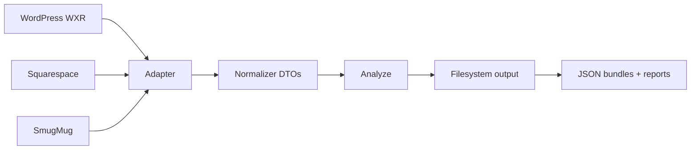
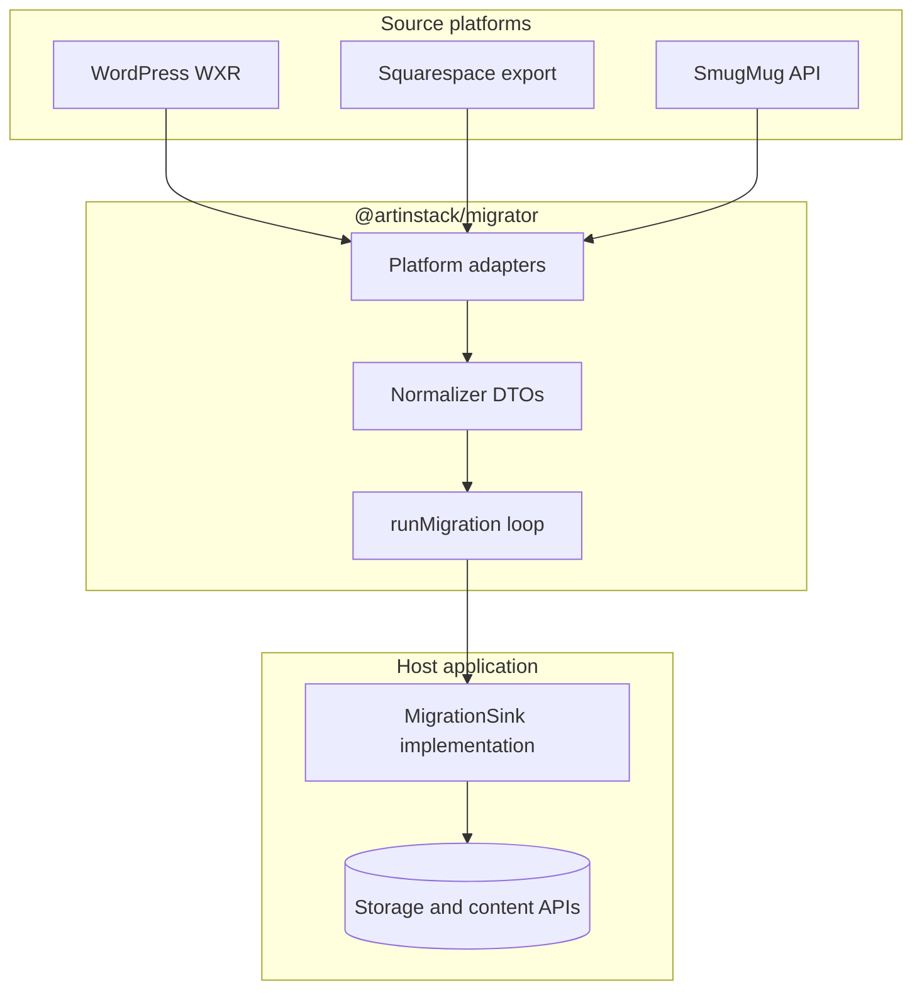

# Architecture blueprint

`@artinstack/migrator` is a **stateless, platform-agnostic** migration framework and **public OSS** project (MIT). It reads content from third-party sources (WordPress, SmugMug, Squarespace, and similar) and normalizes them into portable data transfer objects (DTOs).

The package owns **parsing, normalization, analysis, and orchestration of the migration loop**. It emits **raw source HTML** in DTOs. **Sanitization, storage uploads, credentials, billing, job queues, and UI** belong to the host application, implemented through `MigrationSink`.

---

## Goals

| Goal | Approach |
|------|----------|
| Support multiple source platforms | Isolated adapters behind one normalizer |
| Debug without side effects | `--dry-run`: parse, normalize, estimate storage, preview slugs and conflicts |
| Validate before integration | JSON export to disk + conflict and migration reports |
| Stay testable without a backend | Adapters emit DTOs, not database rows |
| OSS contributions | Public repo, fixtures, stable interfaces |
| Handle large imports safely | Stream assets through sinks; multi-pass write order; resume from checkpoints |
| Two layout strategies | **Static HTML snapshots** or **structured component trees** (see § Page layout) |

---

## High-level data flow

### Export path — parse and write JSON



### Sink path — parser → normalizer → host writes



The migrator **never** knows object storage, job queues, CMS schemas, or admin tokens. It calls `sink.createPost(...)`, `sink.createPage(...)`, and similar methods defined by the host.

Long-running imports, progress UI, and retry policy are **host concerns** (worker + job store)—not part of this package.

---

## Package layout

```
src/
  parsers/              WordPress, SmugMug, Squarespace → normalizer DTOs
  normalizer/           Canonical types + portable idempotency helpers
  helpers/
    rewrite-inline-images.ts
  cli/                  artinstack-migrate
  sinks/
    filesystem.ts       Write JSON bundles + reports to disk
    types.ts            MigrationSink interface
    run-migration.ts    Canonical write-order dispatch
    dry-run.ts          Parse, normalize, analyze — no writes
    migration-report.ts Build migration-report.json
  transformers/         HtmlToGrapes, css-to-styles (optional)
  index.ts              Public API re-exports
fixtures/               Sample exports and golden JSON for tests
```

**Dependency rule:** no imports from web frameworks, proprietary CMS SDKs, or host-specific libraries. Host apps depend on `@artinstack/migrator`; never the reverse.

---

## Core interfaces

### MigrationAdapter

Each source platform implements an adapter:

```ts
interface MigrationAdapter {
  platform: "wordpress" | "smugmug" | "squarespace";
  validateInput(input: unknown): ValidationResult | Promise<ValidationResult>;
  enumerateEntities(ctx: AdapterContext): AsyncIterable<NormalizedEntity>;
}
```

- **`validateInput`** — parse credentials or export files; return counts and validation issues.
- **`enumerateEntities`** — lazy async iterator so large exports are not loaded into memory at once.

### Source metadata

Every normalized entity carries provenance for debugging, conflict reports, and redirect maps:

```ts
interface SourceMetadata {
  platform: "wordpress" | "smugmug" | "squarespace";
  id: string;           // origin system id (e.g. wp:post_id)
  url?: string;         // canonical permalink on source site
  path?: string;        // root-relative path (e.g. /2024/10/my-post/)
  exportedAt?: string;  // ISO timestamp from export file when known
}
```

WordPress: extract absolute URL from `<link>`, normalize to `path`; keep flat `slug` from `<wp:post_name>` independent of dated permalink structure.

### Normalizer DTOs

Adapters emit **canonical entities**, not host-specific records:

| Entity | Purpose |
|--------|---------|
| `NormalizedPost` | Blog posts and articles — **raw** `contentHtml` |
| `NormalizedPage` | Static pages — **raw** `contentHtml`, optional `contentCss` |
| `NormalizedAsset` | Remote file to stream into storage (`sourceUrl`, filename, mime) |
| `NormalizedPortfolio` | Gallery or album grouping |
| `NormalizedCategory` / `NormalizedTag` | Taxonomy |

Common fields: `source`, `sourceId`, `slug`, `title`, `status`, SEO fields. WordPress posts may include `sourceFeaturedMediaId` (unresolved attachment id) and `featuredAssetSourceId` after attachment index resolution.

**HTML boundary:** parsers emit faithful source HTML. Security sanitization happens in the **host sink** immediately before content API writes—not in this package.

### MigrationSink

The host implements all persistence:

```ts
interface MigrationSink {
  createCategory?(category: NormalizedCategory): Promise<{ targetId: string }>;
  createTag?(tag: NormalizedTag): Promise<{ targetId: string }>;
  createPost(post: NormalizedPost): Promise<CreatePostResult>;
  createPage(page: NormalizedPage): Promise<CreatePageResult>;
  createPortfolio?(portfolio: NormalizedPortfolio): Promise<{ targetId: string }>;
  uploadAsset(input: UploadAssetInput): Promise<UploadAssetResult>;
  reportProgress?(progress: MigrationProgress): Promise<void>;
  findExisting?(key: EntityKey): Promise<string | undefined>;
}
```

`runMigration({ sink, entities, platform })` dispatches entities in **canonical write order** (see below), skips completed work when idempotency data exists, and collects results for the migration report.

### Canonical write order

`runMigration` must not rely on export file order. Process entities in this sequence:

```
1. Taxonomy        → NormalizedCategory, NormalizedTag
2. Media assets    → NormalizedAsset (stream/upload)
3. Portfolios      → NormalizedPortfolio
4. Content         → NormalizedPost, NormalizedPage
5. M2M bindings    → portfolio_media, post↔category/tag links
6. Redirects       → host redirect map (from source.path → target path)
```

Implement via multi-pass iteration over the async entity stream or buffered lightweight indexes.

---

## Dry-run and reports

### Dry-run (`--dry-run`)

Parse and normalize without calling `MigrationSink` or writing content:

| Step | Output |
|------|--------|
| Parse | Validate export structure; surface parse errors |
| Normalize | Build DTO set (in memory or streaming tallies) |
| Storage estimate | Sum asset sizes via HTTP `HEAD`; **4 MB fallback per asset** when URL is dead (404, timeout, DNS failure) |
| Slug preview | List slugs with intended public paths |
| Conflicts | `conflicts.json` — see below |

Exit codes: `0` clean, `1` blocking conflicts, `2` warnings only (configurable).

Storage estimates are **advisory**—hosts should not hard-block imports solely because legacy attachment URLs are unreachable.

### Conflict report (`conflicts.json`)

| Category | Detection |
|----------|-----------|
| Duplicate post slugs | Same `slug` among posts — host may auto-suffix on write |
| Duplicate page slugs | Same `slug` among pages — **blocking**; skip with report |
| Missing featured images | `sourceFeaturedMediaId` not in attachment index |
| Unsupported blocks | Source blocks with no component mapping |
| Oversized media | `Content-Length` exceeds host limit when HEAD succeeds |
| Stale asset URLs | HEAD failure — warning + fallback size in estimate |
| Parse issues | Malformed HTML noted on raw `contentHtml` (not sanitizer output) |
| Redirect loops | `fromPath === toPath` |

### Migration report (`migration-report.json`)

Emitted at end of dry-run, export, and sink runs:

```json
{
  "runId": "…",
  "platform": "wordpress",
  "mode": "dry-run | export | sink | worker",
  "summary": { "posts": 0, "pages": 0, "assets": 0, "storageBytesEstimated": 0 },
  "warnings": [],
  "errors": [],
  "conflicts": {},
  "redirectMap": [{ "fromPath": "/old/path/", "toPath": "/blog/slug", "statusCode": 301 }]
}
```

Hosts may persist this artifact (e.g. object storage keyed by job id) for download in admin UI.

---

## `rewriteInlineImages`

Public helper — no host imports. Host sink supplies upload and replacement logic.

```ts
function rewriteInlineImages(html: string, options: {
  resolveAsset: (src: string) => { originalSrc: string; sourceAssetId?: string } | undefined;
  replaceWith: (ref, uploaded: { targetId: string; publicUrl?: string }) => string;
}): { html: string; referencedSources: string[]; unresolved: string[] };
```

Walk `contentHtml` with cheerio; collect `` (and `srcset` where needed); resolve against the asset index; after `uploadAsset`, rewrite markup per host embed conventions. Unresolved URLs feed the conflict report.

---

## Source platform mapping

### WordPress (WXR)

| Extract | Normalized output |
|---------|-------------------|
| `item` post type `post` | `NormalizedPost` |
| `<link>` + `<wp:post_name>` | `source.path` + flat `slug` |
| `content:encoded` | **Raw** `contentHtml` |
| `wp:post_date` | `publishedAt` |
| Categories / tags | `NormalizedCategory`, `NormalizedTag` + slugs on post |
| `_thumbnail_id` meta | Two-pass resolution (see § WordPress attachments) |
| Inline `` | `NormalizedAsset` + `rewriteInlineImages` at sink |
| Pages (`page`) | `NormalizedPage` — static HTML snapshot or structured tree |

Strip WordPress shortcodes only where required for parseability—not for security policy.

#### WordPress attachments (two-pass)

Featured images reference attachment ids, not inline bytes:

1. **Index pass** — build `Map<wpPostId, attachmentUrl>` from all `<item post_type="attachment">` nodes.
2. **Resolve pass** — set `featuredAssetSourceId` on posts; emit `NormalizedAsset` rows; flag missing ids in conflicts.
3. **Sink pass** — after upload, set featured media on the created post.

### SmugMug

| Extract | Normalized output |
|---------|-------------------|
| Folder / album hierarchy | `NormalizedPortfolio` |
| Image originals via API | `NormalizedAsset` linked to portfolio |
| Captions / keywords | `caption`, tags where supported |
| EXIF/IPTC | Preserved in asset metadata when present in source |

**Live API (public package):** `src/parsers/smugmug/api.ts` ships OAuth 1.0a signing, endpoint paths, pagination, bounded retry/throttle, and recursive node crawl. **No secrets in the package** — hosts or CLI pass `SmugMugCredentials` at runtime (`SMUGMUG_CONSUMER_KEY`, `SMUGMUG_CONSUMER_SECRET`, `SMUGMUG_ACCESS_TOKEN`, `SMUGMUG_ACCESS_TOKEN_SECRET`). OAuth redirect and token storage stay in the host application.

```ts
import { SmugMugApiClient, readSmugMugCredentialsFromEnv } from "@artinstack/migrator";

const client = new SmugMugApiClient({ credentials: readSmugMugCredentialsFromEnv() });
const doc = await client.crawlExport(); // flat tables → parse-node.ts → DTOs
```

Use bounded concurrency (e.g. 4–8 parallel uploads) per import to respect API rate limits.

### Squarespace

| Extract | Normalized output |
|---------|-------------------|
| Blog posts | `NormalizedPost` |
| Static pages | `NormalizedPage` |
| Block JSON | Flatten to `contentHtml` + minimal CSS, or map to structured component tree |
| Galleries | `NormalizedPortfolio` + linked assets |

CDN and hidden asset URLs require a **URL resolver** before streaming.

---

## Page layout strategies

Two supported approaches for static pages (and optionally posts):

| Strategy | Description |
|----------|-------------|
| **Static HTML snapshots** | Store sanitized HTML (+ optional CSS) for immediate public render; single container acceptable |
| **Structured component trees** | Parse HTML into GrapesJS-style `content` + root `styles[]` via cheerio/jsdom walk |

There is no reliable off-the-shelf server library for arbitrary HTML → full GrapesJS project trees. Options:

| Technique | Use case |
|-----------|----------|
| Virtual DOM walk (cheerio / jsdom) | Bulk migration — explicit component mapping |
| Headless browser | Spot-checks only — too heavy at scale |
| HTML snapshot | Readable pages without perfect editor tree |

**HtmlToGrapesParser** edge cases: inline vs global CSS → root `styles[]`; layout tables/grids → structural wrappers; inline text tags stay inside parent text components.

---

## Media: stream, do not buffer

Per asset:

1. **`HEAD` source URL** — obtain `Content-Length` and `Content-Type` before upload handshake (required for most presigned PUT URLs).
2. **`GET` and stream** — pipe `response.body` to host upload API with known content length.
3. **Register** — filename, MIME type, byte length via host media API.
4. **Idempotency** — record `(platform, sourceId) → targetId`.

Do not buffer multi-gigabyte portfolios on local disk. For RAW or unknown MIME, follow the host's RAW pipeline.

---

## State, idempotency, and resume

| Layer | Mechanism |
|-------|-----------|
| **Host job store** | Job rows: `status`, `stage`, `progress`, `cursor`, `error_log` |
| **Per-entity log** | `(job_id, source_id, entity_type)` unique; states `pending` / `done` / `failed` |
| **CLI checkpoint** | JSON or SQLite under `~/.artinstack/migrate/` — portable `EntityKey` shape |

Portable helpers in `src/normalizer/idempotency.ts` use `EntityKey` (`platform`, `entityType`, `sourceId`).

**Re-run policy:** skip entities already `done`; default duplicate `sourceId` → skip with report.

---

## CLI

Build once (`pnpm build`). Use the published binary or local shortcuts—no global install required.

```bash
# Dry-run
artinstack-migrate wordpress export.xml --dry-run
artinstack-migrate wordpress export.xml --dry-run --report ./preview/

# Export
artinstack-migrate wordpress export.xml --out ./output
artinstack-migrate wordpress export.xml --format json

# Validate structure
artinstack-migrate validate wordpress ./export.xml

# Sink (filesystem or host plugin)
artinstack-migrate wordpress export.xml --sink filesystem --out ./imported
artinstack-migrate wordpress export.xml --sink <host-plugin>
```

### Local development

```bash
node dist/cli/index.js wordpress export.xml --dry-run
pnpm cli wordpress export.xml --dry-run    # same as pnpm migrate
```

`pnpm cli` / `pnpm migrate` run `node dist/cli/index.js`. Rebuild after source changes (`pnpm build` or `pnpm dev` watch).

### Output layout

**Dry-run report directory:**

```
preview/
├── conflicts.json
└── migration-report.json
```

**Export directory:**

```
output/
├── posts.json
├── pages.json
├── media.json
├── categories.json
├── tags.json
├── portfolios.json
├── conflicts.json
└── migration-report.json
```

The CLI does not embed host credentials. Sink plugins and auth are supplied by the host.

---

## Host integration

| Responsibility | Owner |
|----------------|--------|
| `MigrationSink` implementation | Host |
| HTML sanitization before content writes | Host sink |
| Slug collision policy (e.g. post auto-suffix, page skip-with-report) | Host sink |
| Storage quota, thumbs, EXIF pipeline | Host sink |
| `rewriteInlineImages` `replaceWith` (media URLs / embed ids) | Host sink |
| Job queue, worker, progress UI | Host |
| Redirect middleware + `site_redirects` persistence | Host |
| Advisory storage preflight in UI | Host |

Recommended validation path for integrators: **dry-run → review JSON and conflicts → sink import → orchestrated worker**.

Optional: export redirect map CSV when `source.path` differs from destination paths. Enforce redirect uniqueness on `(tenant_id, from_path)` and reject `from_path === to_path`.

---

## Supported sources

| Source | Focus |
|--------|--------|
| WordPress WXR | Editorial content, attachments, taxonomy |
| SmugMug API | Albums, large vaults, EXIF |
| Squarespace | Pages, blog, block flattening |

Optional transformers: **HtmlToGrapes**, **css-to-styles**. Redirect report generation is a host routing concern.

---

## Anti-patterns

| Anti-pattern | Why |
|--------------|-----|
| Sanitizing HTML inside `@artinstack/migrator` | Couples OSS to one host's security policy; sanitize in sink |
| Writing CMS rows without uploading bytes to object storage | Breaks URLs, thumbnails, billing |
| Importing editor JSON without a render snapshot (`content_html`) | Public pages may be empty |
| GrapesJS `Parser` on server without a browser | Inaccurate; use virtual DOM or HTML snapshots |
| Puppeteer for every page in bulk | Memory and cost |
| Assuming `slug: "home"` is site root | Home is often a separate flag on host |
| Downloading tens of GB to `/tmp` | OOM; stream |
| Skipping dry-run on large exports | Conflicts discovered only after failed import |
| PUT without prior `HEAD` / known `Content-Length` | Presigned upload failures and buffering |
| Worker writing CMS/Directus directly | Bypasses quotas and media pipeline — use HTTP APIs via sink |
| Hard-blocking import when attachment URLs are dead | Stale exports are common; advisory estimate + warnings |
| Running import loop inside job-creation HTTP handler | Timeouts and coupling to web tier |
| Long-lived admin tokens in the public package | Credentials belong in host worker only |
| `from_path === to_path` in redirect map | Infinite redirect loop |

---

## Public vs private

| Piece | `@artinstack/migrator` | Host application |
|-------|------------------------|------------------|
| Parsers + normalizer DTOs (raw HTML) | Yes | No |
| SmugMug OAuth signing + API crawl (`api.ts`) | Yes | Supplies credentials |
| Dry-run, conflicts, migration report | Yes | No |
| CLI + filesystem export | Yes | No |
| `rewriteInlineImages` helper | Yes | Supplies `replaceWith` |
| `MigrationSink` interface + `runMigration` | Yes | Implementation |
| Sanitization, uploads, slug policy | No | Yes |
| SmugMug OAuth redirect + token vault | No | Yes |
| Jobs, worker, UI, credentials, billing | No | Yes |

---

## Summary

`@artinstack/migrator` is a **portable OSS core**: platform adapters, normalizer DTOs with `SourceMetadata`, dry-run analysis, JSON export, optional HTML→component transformers, and a **`MigrationSink`-driven** migration loop with explicit write ordering. The package emits **raw HTML** and **never** touches host storage or CMS APIs directly. Hosts implement the sink—sanitization, streaming uploads, slug rules, and orchestration—and own everything operational.
