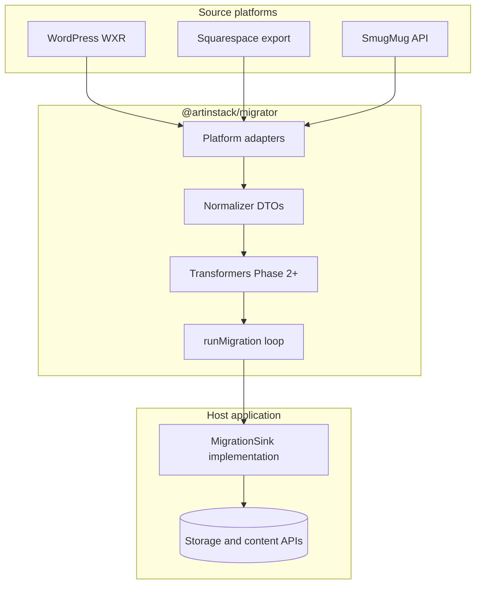

# Architecture blueprint

`@artinstack/migrator` is a **stateless, platform-agnostic** migration framework. It reads content from third-party sources (WordPress, SmugMug, Squarespace, and similar), normalizes it into portable data transfer objects (DTOs), and hands results to a **host application** through a small write interface called `MigrationSink`.

This package owns **parsing and transformation only**. Job queues, authentication, storage credentials, dashboard UI, and database persistence are implemented by the host—not here.

---

## Goals

| Goal | Approach |
|------|----------|
| Support multiple source platforms | Isolated adapters behind one normalizer |
| Stay testable without a running backend | Adapters emit DTOs, not database rows |
| Allow local dry-runs and OSS contributions | CLI + fixtures; no framework-specific imports |
| Handle large imports safely | Stream assets; resume from checkpoints |
| Defer hard layout translation | Phase 1 HTML snapshots; Phase 2+ structured page trees |

---

## High-level data flow



**Typical production shape:** a host API enqueues a long-running job, a worker process loads `@artinstack/migrator`, and the worker calls a host-specific `MigrationSink` to create posts, pages, portfolios, and uploaded media. The migrator itself never holds admin tokens or talks to a CMS directly.

---

## Package layout

```
src/
  parsers/          WordPress, SmugMug, Squarespace → normalizer DTOs
  normalizer/       Canonical types + portable idempotency helpers
  transformers/     HtmlToGrapes (Phase 2+), css-to-styles
  sinks/            MigrationSink interface + runMigration()
  cli/              artinstack-migrate — validate and enumerate
  index.ts          Public API re-exports
fixtures/           Sample exports and golden JSON for tests
```

**Dependency rule:** no imports from Next.js, proprietary CMS SDKs, or host-specific libraries. Host apps depend on `@artinstack/migrator`; never the reverse.

---

## Core interfaces

### MigrationAdapter

Each source platform implements an adapter:

```ts
interface MigrationAdapter {
  platform: "wordpress" | "smugmug" | "squarespace";
  validateInput(input: unknown): ValidationResult | Promise<ValidationResult>;
  enumerateEntities(ctx: AdapterContext): AsyncIterable<NormalizedEntity>;
}
```

- **`validateInput`** — parse credentials or export files; return counts and validation issues before a run starts.
- **`enumerateEntities`** — lazy async iterator so large exports are not loaded into memory at once.

### Normalizer DTOs

Adapters emit **canonical entities**, not host-specific records:

| Entity | Purpose |
|--------|---------|
| `NormalizedPost` | Blog posts and articles |
| `NormalizedPage` | Static pages (HTML snapshot in Phase 1) |
| `NormalizedAsset` | Remote file to stream into storage |
| `NormalizedPortfolio` | Gallery or album grouping |
| `NormalizedCategory` / `NormalizedTag` | Taxonomy |

Shared fields include `sourceId` (stable id from the source platform), `slug`, `title`, `contentHtml`, publish `status`, and optional SEO metadata. These types live in `src/normalizer/types.ts`.

### MigrationSink

The host implements writes:

```ts
interface MigrationSink {
  createPost(post: NormalizedPost): Promise<CreatePostResult>;
  createPage(page: NormalizedPage): Promise<CreatePageResult>;
  createPortfolio?(portfolio: NormalizedPortfolio): Promise<{ targetId: string }>;
  uploadAsset(input: UploadAssetInput): Promise<UploadAssetResult>;
  reportProgress?(progress: MigrationProgress): Promise<void>;
  findExisting?(key: EntityKey): Promise<string | undefined>;
}
```

`runMigration({ sink, entities, platform })` walks the entity stream, skips completed work when idempotency data is available, and dispatches each entity to the appropriate sink method.

---

## Source platform mapping

### WordPress (WXR) — editorial focus

| Extract | Normalized output |
|---------|-------------------|
| `item` post type `post` | `NormalizedPost` |
| `wp:post_name` | `slug` (sanitize; handle collisions with suffix or report) |
| `content:encoded` HTML | `contentHtml` (sanitized) |
| `wp:post_date` | `publishedAt` |
| Categories / tags | `NormalizedCategory`, `NormalizedTag` + slugs on post |
| Featured image attachment | `NormalizedAsset` → link on post |
| Inline `` | Resolve to assets; rewrite URLs in HTML during ingest |
| Pages (`page` post type) | `NormalizedPage` — Phase 1: HTML snapshot; Phase 2: structured layout |

Strip shortcodes and unsafe inline styles according to host policy during sanitization.

### SmugMug — media vault focus

| Extract | Normalized output |
|---------|-------------------|
| Folder / album hierarchy | `NormalizedPortfolio` (optional parent nesting via slug prefix) |
| Image originals via API | `NormalizedAsset` linked to portfolio |
| Captions / keywords | `caption`, tags where supported |
| EXIF/IPTC | Preserved when present in downloaded bytes |

Use a **bounded concurrency pool** (e.g. 4–8 parallel uploads) per job to respect API rate limits.

### Squarespace — pages + blog

| Extract | Normalized output |
|---------|-------------------|
| Blog posts | `NormalizedPost` (same HTML path as WordPress) |
| Static pages | `NormalizedPage` |
| Block JSON (Text, Image, Spacer, …) | Phase 2: map to page builder components; Phase 1: flatten to `contentHtml` + minimal CSS |
| Galleries | `NormalizedPortfolio` + linked assets |

Squarespace exports often reference CDN URLs that require a **URL resolver** step before assets are streamed.

---

## HTML → page builder (Phase 2+)

There is no reliable off-the-shelf npm package that converts arbitrary HTML exports into a full **GrapesJS-style** project tree (`content` components + detached root `styles[]`).

### Recommended approach

| Option | When to use |
|--------|-------------|
| **Virtual DOM walk** (cheerio / jsdom) | Default for bulk migration — explicit component mapping |
| **Headless browser** (Puppeteer / Playwright) | Spot-checks or pixel audits only — too heavy at scale |
| **HTML snapshot** (Phase 1) | Ship readable pages immediately; refine in editor later |

### Edge cases for `HtmlToGrapesParser`

| Problem | Approach |
|---------|----------|
| Inline vs global CSS | Map inline `style` to component attributes; parse `<style>` and class rules into root `styles[]` |
| Layout (grid, flex, tables) | Structural mapping options — e.g. three-column section → flex row + columns |
| Inline text (`<b>`, `<strong>` inside `<p>`) | Keep markup inside parent text components; do not over-split into child components |

Phase 1 imports pages as **`contentHtml` (+ optional `contentCss`) snapshots** so public sites render without a perfect component tree.

---

## Media: stream, do not buffer

Large portfolios must not be written to local disk on the worker.

Recommended flow per asset:

1. `HEAD` or `GET` the source URL.
2. Pipe `response.body` directly into object storage via the host's upload API.
3. Register the asset with filename, MIME type, and byte length.
4. Record idempotency: `(platform, sourceId) → targetId`.

For RAW or unknown MIME types, follow the host's existing RAW pipeline rather than guessing extensions.

---

## State, idempotency, and resume

| Layer | Mechanism |
|-------|-----------|
| **Production jobs** | Host persists job rows: `status`, `stage`, `progress`, `cursor`, `error_message`, `retry_count` |
| **Per-entity tracking** | `(job_id, source_id, entity_type)` with state `pending` / `done` / `failed` |
| **CLI / local dev** | JSON or SQLite checkpoint under `~/.artinstack/migrate/` using the same portable key shape |

**Resume:** skip entities already marked `done`. **Re-run:** default policy is skip-with-report when the same `sourceId` was imported before.

Portable helpers live in `src/normalizer/idempotency.ts`; they use `EntityKey` (`platform`, `entityType`, `sourceId`) rather than host-specific column names.

---

## CLI

```bash
pnpm build

# Validate an export before running
artinstack-migrate validate wordpress ./export.xml

# List normalized entities (dry-run)
artinstack-migrate enumerate wordpress ./export.xml --dry-run
```

The CLI exercises adapters only—it does not call `MigrationSink` unless wired by a host integration.

---

## Integration guide for host applications

1. **Enqueue** migration jobs asynchronously (return `202 Accepted` quickly; never run the import loop inside a web request handler).
2. **Run a worker** that loads `@artinstack/migrator`, selects the adapter, and passes entities to `runMigration`.
3. **Implement `MigrationSink`** against your content and media APIs—enforcing quotas, slug uniqueness, and thumbnail generation in one place.
4. **Poll or push job status** to your UI from the host's job store.
5. **Optional:** export a redirect map (CSV) when source URLs differ from destination paths.

---

## Implementation order

| Priority | Module | Complexity |
|----------|--------|------------|
| 1 | WordPress WXR | Medium — HTML + attachments |
| 2 | SmugMug API | High — auth, rate limits, streaming |
| 3 | Squarespace | High — block translation deferred to Phase 2 |
| 4 | HtmlToGrapes transformer | Very high — custom virtual DOM mapping |
| 5 | Redirect report export | Medium — host middleware is separate |

---

## Anti-patterns

| Anti-pattern | Why |
|--------------|-----|
| Writing CMS rows without uploading bytes to object storage | Breaks asset URLs, thumbnails, and billing |
| Importing HTML only into editor JSON without a render snapshot | Public pages may be blank until manual save |
| Running GrapesJS `Parser` on the server without a browser | Inaccurate; use cheerio/jsdom or Phase 1 snapshots |
| Puppeteer for every page in bulk | Cost and memory risk |
| Assuming `slug: "home"` means site root | Home page is often a separate flag on the host |
| Downloading tens of GB to `/tmp` | OOM and slow; stream instead |
| Running the import loop inside the job-creation HTTP handler | Timeouts and coupling to the web tier |
| Embedding long-lived admin tokens in the public package | Credentials belong in the host worker only |

---

## Phased roadmap (this repo)

### Phase 1 — Foundation

- [ ] WordPress WXR adapter + HTML sanitization
- [ ] Stable normalizer DTOs and `MigrationSink` contract
- [ ] `runMigration` with idempotency helpers
- [ ] CLI validate / enumerate
- [ ] Fixture-based tests

### Phase 2 — Scale and sources

- [ ] SmugMug adapter + concurrency controls
- [ ] Squarespace HTML fallback import
- [ ] Asset URL resolver utilities
- [ ] Redirect map export helper (CSV)

### Phase 3 — Layout fidelity

- [ ] `HtmlToGrapesParser` — cheerio/jsdom walk → `content` + root `styles`
- [ ] `css-to-styles` for global rules
- [ ] Publish stable `@artinstack/migrator` on npm

---

## Summary

`@artinstack/migrator` is the **portable core**: adapters, normalizer DTOs, optional HTML→page-builder transformers, and a sink-driven execution loop. Host applications own orchestration, credentials, and persistence. Phase 1 optimizes for **correct, readable imports** via HTML snapshots; Phase 2+ invests in **editable structured layouts** without coupling this package to any single CMS or cloud stack.
