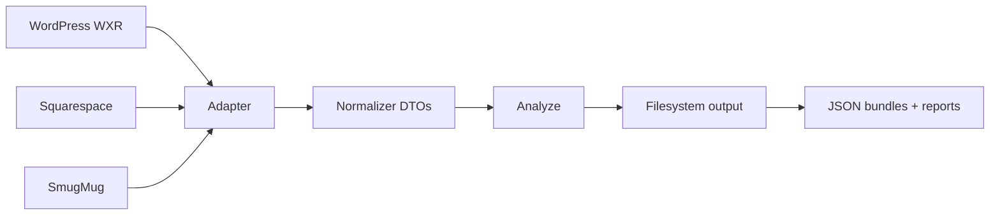
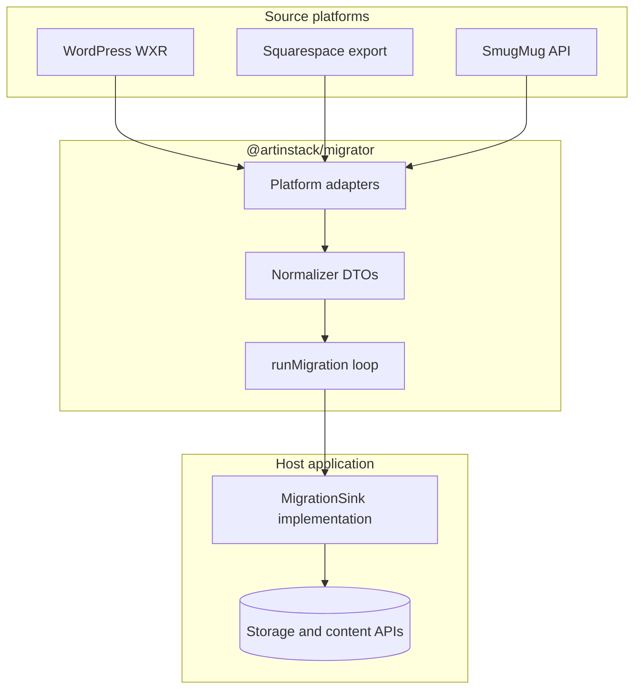

# Architecture blueprint

`@artinstack/migrator` is a **stateless, platform-agnostic** migration framework and **public OSS** project (MIT). It reads content from third-party sources (WordPress, SmugMug, Squarespace, and similar) and normalizes them into portable data transfer objects (DTOs).

The package owns **parsing, normalization, analysis, and orchestration of the migration loop**. It emits **raw source HTML** in DTOs. **Sanitization, storage uploads, credentials, billing, job queues, and UI** belong to the host application, implemented through `MigrationSink`.

---

## Goals

| Goal | Approach |
|------|----------|
| Support multiple source platforms | Isolated adapters behind one normalizer |
| Debug without side effects | `--dry-run`: parse, normalize, estimate storage, preview slugs and conflicts |
| Validate before integration | JSON export to disk + conflict and migration reports |
| Stay testable without a backend | Adapters emit DTOs, not database rows |
| OSS contributions | Public repo, fixtures, stable interfaces |
| Handle large imports safely | Stream assets through sinks; multi-pass write order; resume from checkpoints |
| Two layout strategies | **Static HTML snapshots** or **structured component trees** (see § Page layout) |

---

## High-level data flow

### Export path — parse and write JSON



### Sink path — parser → normalizer → host writes



The migrator **never** knows object storage, job queues, CMS schemas, or admin tokens. It calls `sink.createPost(...)`, `sink.createPage(...)`, and similar methods defined by the host.

Long-running imports, progress UI, and retry policy are **host concerns** (worker + job store)—not part of this package.

---

## Package layout

```
src/
  parsers/              WordPress, SmugMug, Squarespace, Wix → normalizer DTOs
    wordpress/          WXR parse, builder flattening (theme registry), asset discovery
    squarespace/        parse-export.ts — block flattening + static HTML snapshots
  normalizer/           Canonical types, idempotency, opt-in validate.ts (Zod)
  lib/                  media-urls, utility
  test/                 all unit tests (mirrors src/ layout; not shipped)
  transformers/         HtmlToGrapes, css-to-styles, rewrite-inline-images, expand-migration-media-refs
  cli/                  artinstack-migrate
  sinks/
    filesystem.ts       Write JSON bundles + reports to disk
    types.ts            MigrationSink interface
    run-migration.ts    Canonical write-order dispatch
    dry-run.ts          Parse, normalize, analyze — no writes
    migration-report.ts Build migration-report.json
  index.ts              Public API re-exports
fixtures/               Sample exports and golden JSON (incl. grapes/ HtmlToGrapes snapshots)
```

**Package export subpaths** (separate bundles for tree-shaking / smaller client imports):

| Subpath | Use when |
|---------|----------|
| `@artinstack/migrator` | Full pipeline — parsers, sink types, CLI consumers |
| `@artinstack/migrator/transformers` | `htmlToGrapes`, `htmlToTiptap`, `rewriteInlineImages`, `expandMigrationMediaRefs` — no WXR/parser code |
| `@artinstack/migrator/normalizer` | DTO types + validation |
| `@artinstack/migrator/sinks` | `MigrationSink`, `runMigration`, dry-run |
| `@artinstack/migrator/lib` | `discoverContentAssetUrls`, migration media ref helpers, origin URL rewrite |

**Dependency rule:** no imports from web frameworks, proprietary CMS SDKs, or host-specific libraries. Host apps depend on `@artinstack/migrator`; never the reverse.

---

## Core interfaces

### MigrationAdapter

Each source platform implements an adapter:

```ts
interface MigrationAdapter {
  platform: "wordpress" | "smugmug" | "squarespace";
  validateInput(input: unknown): ValidationResult | Promise<ValidationResult>;
  enumerateEntities(ctx: AdapterContext): AsyncIterable<NormalizedEntity>;
}
```

- **`validateInput`** — parse credentials or export files; return counts and validation issues.
- **`enumerateEntities`** — lazy async iterator so large exports are not loaded into memory at once.

### Source metadata

Every normalized entity carries provenance for debugging, conflict reports, and redirect maps:

```ts
interface SourceMetadata {
  platform: "wordpress" | "smugmug" | "squarespace";
  id: string;           // origin system id (e.g. wp:post_id)
  url?: string;         // canonical permalink on source site
  path?: string;        // root-relative path (e.g. /2024/10/my-post/)
  exportedAt?: string;  // ISO timestamp from export file when known
}
```

WordPress: extract absolute URL from `<link>`, normalize to `path`; keep flat `slug` from `<wp:post_name>` independent of dated permalink structure.

### Normalizer DTOs

Adapters emit **canonical entities**, not host-specific records:

| Entity | Purpose |
|--------|---------|
| `NormalizedPost` | Blog posts and articles — `contentHtml` (portable HTML after adapter preprocessing) |
| `NormalizedPage` | Static pages — `contentHtml`, optional `contentCss`, optional `layoutHints` (signals for theme chrome not present in body HTML, e.g. hero slider alias) |
| `NormalizedAsset` | Remote file to stream into storage (`sourceUrl`, filename, mime) |
| `NormalizedPortfolio` | Gallery or album grouping |
| `NormalizedCategory` / `NormalizedTag` | Taxonomy |

**HTML boundary:** WordPress adapters flatten common page-builder shortcodes to portable HTML **before** DTO emission. Parsers do not sanitize. Security sanitization happens in the **host sink** immediately before content API writes—not in this package.

Common fields: `source`, `sourceId`, `slug`, `title`, `status`, SEO fields. WordPress posts may include `sourceFeaturedMediaId` (unresolved attachment id) and `featuredAssetSourceId` (attachment id or first inline asset fallback). WordPress pages may include `layoutHints` when post meta references layout outside `contentHtml` (see WordPress § hero sliders).

### MigrationSink

The host implements all persistence:

```ts
interface MigrationSink {
  createCategory?(category: NormalizedCategory): Promise<{ targetId: string }>;
  createTag?(tag: NormalizedTag): Promise<{ targetId: string }>;
  createPost(post: NormalizedPost): Promise<CreatePostResult>;
  createPage(page: NormalizedPage): Promise<CreatePageResult>;
  createPortfolio?(portfolio: NormalizedPortfolio): Promise<{ targetId: string }>;
  uploadAsset(input: UploadAssetInput): Promise<UploadAssetResult>;
  reportProgress?(progress: MigrationProgress): Promise<void>;
  findExisting?(key: EntityKey): Promise<string | undefined>;
}
```

`runMigration({ sink, entities, platform })` dispatches entities in **canonical write order** (see below), skips completed work when idempotency data exists, and collects results for the migration report.

### Canonical write order

`runMigration` must not rely on export file order. Process entities in this sequence:

```
1. Taxonomy        → NormalizedCategory, NormalizedTag
2. Media assets    → NormalizedAsset (stream/upload)
3. Portfolios      → NormalizedPortfolio
4. Content         → NormalizedPost, NormalizedPage
5. M2M bindings    → portfolio_media, post↔category/tag links
6. Redirects       → host redirect map (from source.path → target path)
```

Implement via multi-pass iteration over the async entity stream or buffered lightweight indexes.

---

## Dry-run and reports

### Dry-run (`--dry-run`)

Parse and normalize without calling `MigrationSink` or writing content:

| Step | Output |
|------|--------|
| Parse | Validate export structure; surface parse errors |
| Normalize | Build DTO set (in memory or streaming tallies) |
| Storage estimate | Sum asset sizes via HTTP `HEAD`; **4 MB fallback per asset** when URL is dead (404, timeout, DNS failure) |
| Slug preview | List slugs with intended public paths |
| Conflicts | `conflicts.json` — see below |

Exit codes: `0` clean, `1` blocking conflicts, `2` warnings only (configurable).

Storage estimates are **advisory**—hosts should not hard-block imports solely because legacy attachment URLs are unreachable.

### Conflict report (`conflicts.json`)

| Category | Detection |
|----------|-----------|
| Duplicate post slugs | Same `slug` among posts — host may auto-suffix on write |
| Duplicate page slugs | Same `slug` among pages — **blocking**; skip with report |
| Missing featured images | `sourceFeaturedMediaId` not in attachment index |
| Unsupported blocks | Source blocks with no component mapping |
| Oversized media | `Content-Length` exceeds host limit when HEAD succeeds |
| Stale asset URLs | HEAD failure — warning + fallback size in estimate |
| Parse issues | Malformed HTML noted on raw `contentHtml` (not sanitizer output) |
| Redirect loops | `fromPath === toPath` |

### Migration report (`migration-report.json`)

Emitted at end of dry-run, export, and sink runs:

```json
{
  "runId": "…",
  "platform": "wordpress",
  "mode": "dry-run | export | sink | worker",
  "summary": { "posts": 0, "pages": 0, "assets": 0, "storageBytesEstimated": 0 },
  "warnings": [],
  "errors": [],
  "conflicts": {},
  "redirectMap": [{ "fromPath": "/old/path/", "toPath": "/blog/slug", "statusCode": 301 }]
}
```

Hosts may persist this artifact (e.g. object storage keyed by job id) for download in admin UI.

---

## Migration media refs

WordPress exports often reference the same upload under many URL shapes — API gateway, public origin, flat vs dated `wp-content/uploads/…` paths. Jamstack gateway sites (e.g. naikonpixels) and standard WordPress share the problem: one asset, many URL aliases.

**Problem with host-side URL chasing:** the host builds a large origin URL index (gateway, public site, basename variants) and rewrites in HTML, CSS, and the Grapes tree. That is fragile because hero promotion / `htmlToGrapes` can copy a URL before host rewrite runs, and every new alias shape needs another sweep.

**Approach:** OSS normalizes upload URLs to a stable normalizer `sourceId` and stamps an **editor-neutral ref**; the host resolves that id to a CDN URL once at persist boundaries.

**Discovery vs resolution:** Finding media in exported content is separate from resolving it to fetchable URLs. Some images appear as direct paths in HTML; others appear only as WordPress attachment ids until the export includes attachment rows, a supplemental media export is bundled, or the host resolves ids against the live site. Dry-run artifacts report discovered versus resolved counts. When an export contains no importable pages or posts (for example commerce-only or builder-global-only XML), summaries explain what was skipped so an empty preview is not mistaken for a parser failure.

| Layer | Responsibility |
|-------|----------------|
| **OSS** (`parse-wxr`, `rewriteInlineImages`, builder flatten) | Map `wp-content/uploads` URLs → `sourceId` via attachment index + inline discovery; stamp `artinstack-migration://asset/{sourceId}` in ``, `srcset`, `data-bg-image`, and CSS `url()` |
| **Host** (`expandMigrationMediaRefs`) | Look up `sourceId` → `publicUrl` (e.g. `migration_entities` + object storage) before sink write or page import |

Refs use a **pseudo-URL scheme**, not WordPress shortcode syntax (avoids colliding with builder shortcodes and works in attributes/CSS):

```
artinstack-migration://asset/wordpress:attachment:4507
artinstack-migration://asset/url%3Ahttps%3A%2F%2Fwww.example.com%2Fwp-content%2Fuploads%2Fhero.jpg
```

**Example — gateway hero on naikonpixels about page:**

```
Input:    https://75b6txrbn2.execute-api.us-west-2.amazonaws.com/prod/wp-content/uploads/About_w_2048.jpg
          → origin rewrite → https://www.naikonpixels.com/wp-content/uploads/About_w_2048.jpg
sourceId: url:https://www.naikonpixels.com/wp-content/uploads/About_w_2048.jpg
Stamped:  artinstack-migration://asset/url%3Ahttps%3A%2F%2Fwww.naikonpixels.com%2Fwp-content%2Fuploads%2FAbout_w_2048.jpg
```

The host never needs to know which origin host the URL came from — only `sourceId` → `targetId` → `publicUrl`. Unresolved URLs are left unchanged and surface in `conflicts.unresolvedInlineImages` (refs are not counted as unresolved).

OSS stamps via `parse-wxr` (default `stampMigrationMediaRefs: true`), `rewriteInlineImages`, and builder flatten. Discovery runs on raw URLs first; stamping is a second pass once the URL → `sourceId` index exists. The host expands via `expandMigrationMediaRefs` **before** DB write — Page Editor expects `data-bg-image` to be a real URL at persist time, not only at render time. These helpers are separate from page-builder flatten, which runs in the adapter before DTOs are emitted.

Imports and call-site usage: [README § Migration media refs](../README.md#migration-media-refs).

---

## Source platform mapping

### WordPress (WXR)

**Input:** WXR (XML) only — not `.wpress` or other full-site backups. See [§ Supported input formats](#supported-input-formats).

| Extract | Normalized output |
|---------|-------------------|
| `item` post type `post` | `NormalizedPost` |
| `<link>` + `<wp:post_name>` | `source.path` + flat `slug` |
| `content:encoded` | `contentHtml` after optional builder flatten + origin rewrite |
| `wp:post_date` | `publishedAt` |
| Categories / tags | `NormalizedCategory`, `NormalizedTag` + slugs on post |
| `_thumbnail_id` meta | Attachment index + first-inline-image fallback (see § WordPress attachments) |
| Inline ``, `data-bg-image`, CSS `url()` | `NormalizedAsset`; `contentHtml` stamped with migration media refs |
| Pages (`page`) | `NormalizedPage` — static HTML snapshot |
| `post_type=portfolio` (configurable CPT slugs) | `NormalizedPage` with `source.postType` — project singles, not `NormalizedPortfolio` |
| Theme hero slider meta (RevSlider / MasterSlider) | `layoutHints.heroSlider` on `NormalizedPage` — plugin id + slider alias only (slides not in standard WXR) |
| In-body `[rev_slider]` / `[masterslider]` | `data-wp-widget="slider"` stub in `contentHtml` — alias only |

#### Page builders (theme registry)

Many WordPress exports mix **shortcodes** (Tatsu, Oshine/Blox, Divi, Elementor, …) with plain HTML. The WordPress adapter applies a **declarative theme registry** in two passes **before** DTOs are emitted:

| Bucket | Role | Examples |
|--------|------|----------|
| **Content blockers** | Map asset/text shortcodes → standard HTML | `[tatsu_image image=…]` → ``; `special_sub_title` → `<p>` |
| **Scaffolding** | Strip layout shortcodes; keep inner text | `[tatsu_section]`, `[blox_row]`, `[section]` / `[row]` |

Registered theme families ship in OSS (e.g. Tatsu, Oshine, Divi, Elementor). New families add a registry row—not per-page logic.

**Dynamic widgets** (maps, contact forms, blog rolls, portfolio grids, testimonials, features grids, in-body sliders, …) flatten to `data-wp-widget` HTML stubs in `contentHtml`. The **host** maps stubs to platform blocks. **Theme hero sliders** referenced only in post meta are **not** inlined into `contentHtml`; they appear on `NormalizedPage.layoutHints.heroSlider` (alias only — hosts rebuild or hydrate slide data from source WP when needed).

WooCommerce system pages (`cart`, `checkout`, `my-account`) are skipped by default. Unresolvable commerce shortcodes are reported in `conflicts.unsupportedBlocks`.

This is **separate from** migration media ref stamping (`rewriteInlineImages` / `stampMigrationMediaRefs`), which runs after flatten and origin rewrite and covers ``, `srcset`, `data-bg-image`, and inline CSS backgrounds.

#### Origin URL rewrite

Exports that reference a **legacy gateway or staging host** (e.g. API Gateway `/prod/wp-content/…`) can rewrite those paths to a **public CDN origin** before asset discovery and dry-run HEAD checks. Configure via adapter `originUrlRewrite` or CLI `--rewrite-gateway` / `--rewrite-public`.

#### WordPress attachments (two-pass)

Featured images reference attachment ids, not inline bytes:

1. **Index pass** — build `Map<wpPostId, attachmentUrl>` from all `<item post_type="attachment">` nodes.
2. **Resolve pass** — set `featuredAssetSourceId` on posts; emit `NormalizedAsset` rows; flag missing ids in conflicts.
3. **Sink pass** — after upload, set featured media on the created post.

### SmugMug

| Extract | Normalized output |
|---------|-------------------|
| Folder / album hierarchy | `NormalizedPortfolio` |
| Image originals via API | `NormalizedAsset` linked to portfolio |
| Captions / keywords | `caption`, tags where supported |
| EXIF/IPTC | Preserved in asset metadata when present in source |

**Live API (public package):** `src/parsers/smugmug/api.ts` ships OAuth 1.0a signing, endpoint paths, pagination, bounded retry/throttle, and recursive node crawl. **No secrets in the package** — hosts or CLI pass `SmugMugCredentials` at runtime (`SMUGMUG_CONSUMER_KEY`, `SMUGMUG_CONSUMER_SECRET`, `SMUGMUG_ACCESS_TOKEN`, `SMUGMUG_ACCESS_TOKEN_SECRET`). OAuth redirect and token storage stay in the host application.

```ts
import { SmugMugApiClient, readSmugMugCredentialsFromEnv } from "@artinstack/migrator";

const client = new SmugMugApiClient({ credentials: readSmugMugCredentialsFromEnv() });
const doc = await client.crawlExport(); // flat tables → parse-node.ts → DTOs
```

Use bounded concurrency (e.g. 4–8 parallel uploads) per import to respect API rate limits.

### Squarespace

| Extract | Normalized output |
|---------|-------------------|
| Blog posts | `NormalizedPost` |
| Static pages | `NormalizedPage` |
| Block JSON | Flatten to `contentHtml` + minimal CSS, or map to structured component tree |
| Galleries | `NormalizedAsset` rows from gallery/image blocks |
| Unsupported blocks | Placeholder markers → `conflicts.unsupportedBlocks[]` |

**Export format:** JSON (`exportVersion: 1`) with `pages[]` / `posts[]` and either `blocks[]` or pre-rendered `contentHtml`. Parser: `src/parsers/squarespace/parse-export.ts`.

**Live collection (public package):** `src/parsers/squarespace/collect.ts` appends `?format=json-pretty`, maps wire JSON → `SquarespaceExport`, and paginates collection lists. **No cookies or API keys in the package** — the host injects an authenticated `fetch` (session cookies, proxy, etc.).

```ts
import { SquarespaceCollectionClient, squarespaceAdapter } from "@artinstack/migrator";

const client = new SquarespaceCollectionClient({
  fetchImpl: authenticatedFetch, // host-supplied
});

for await (const entity of squarespaceAdapter.enumerateEntities({
  input: {
    client,
    collectTargets: [
      { url: "https://example.com/journal", kind: "collection" },
      { url: "https://example.com/about", kind: "page" },
    ],
  },
})) {
  // → NormalizedPage / NormalizedPost
}
```

CDN and hidden asset URLs require a **URL resolver** before streaming.

---

## Page layout strategies

Two supported approaches for static pages (and optionally posts):

| Strategy | Description |
|----------|-------------|
| **Static HTML snapshots** | Store sanitized HTML (+ optional CSS) for immediate public render; single container acceptable |
| **Structured component trees** | Parse HTML into GrapesJS-style `content` + root `styles[]` via cheerio/jsdom walk |

There is no reliable off-the-shelf server library for arbitrary HTML → full GrapesJS project trees. Options:

| Technique | Use case |
|-----------|----------|
| Virtual DOM walk (cheerio / jsdom) | Bulk migration — explicit component mapping |
| Headless browser | Spot-checks only — too heavy at scale |
| HTML snapshot | Readable pages without perfect editor tree |

**HtmlToGrapesParser** edge cases: inline vs global CSS → root `styles[]`; layout tables/grids → structural wrappers; inline text tags stay inside parent text components; `tagMap` / `componentMap` / `layoutTypeMap` for host component typing.

---

## Media: stream, do not buffer

Per asset:

1. **`HEAD` source URL** — obtain `Content-Length` and `Content-Type` before upload handshake (required for most presigned PUT URLs).
2. **`GET` and stream** — pipe `response.body` to host upload API with known content length.
3. **Register** — filename, MIME type, byte length via host media API.
4. **Idempotency** — record `(platform, sourceId) → targetId`.

Do not buffer multi-gigabyte portfolios on local disk. For RAW or unknown MIME, follow the host's RAW pipeline.

---

## State, idempotency, and resume

| Layer | Mechanism |
|-------|-----------|
| **Host job store** | Job rows: `status`, `stage`, `progress`, `cursor`, `error_log` |
| **Per-entity log** | `(job_id, source_id, entity_type)` unique; states `pending` / `done` / `failed` |
| **CLI checkpoint** | JSON or SQLite under `~/.artinstack/migrate/` — portable `EntityKey` shape |

Portable helpers in `src/normalizer/idempotency.ts` use `EntityKey` (`platform`, `entityType`, `sourceId`).

**Re-run policy:** skip entities already `done`; default duplicate `sourceId` → skip with report.

---

## CLI

Build once (`pnpm build`). Use the published binary or local shortcuts—no global install required.

```bash
# Dry-run
artinstack-migrate wordpress export.xml --dry-run
artinstack-migrate wordpress export.xml --dry-run --report ./preview/

# Export
artinstack-migrate wordpress export.xml --out ./output
artinstack-migrate wordpress export.xml --format json

# Validate structure
artinstack-migrate validate wordpress ./export.xml

# Sink (filesystem only in OSS CLI; host sink via runMigration() in app code)
artinstack-migrate wordpress export.xml --sink filesystem --out ./imported
```

### Local development

```bash
node dist/cli/index.js wordpress export.xml --dry-run
pnpm cli wordpress export.xml --dry-run    # same as pnpm migrate
```

`pnpm cli` / `pnpm migrate` run `node dist/cli/index.js`. Rebuild after source changes (`pnpm build` or `pnpm dev` watch).

### Output layout

**Dry-run report directory:**

```
preview/
├── conflicts.json
└── migration-report.json
```

**Export directory:**

```
output/
├── posts.json
├── pages.json
├── media.json
├── categories.json
├── tags.json
├── portfolios.json
├── conflicts.json
└── migration-report.json
```

The CLI does not embed host credentials. Sink plugins and auth are supplied by the host.

---

## Host integration

| Responsibility | Owner |
|----------------|--------|
| `MigrationSink` implementation | Host |
| HTML sanitization before content writes | Host sink |
| WordPress builder flattening + origin URL rewrite (pre-DTO) | OSS adapter (optional CLI flags) |
| Dynamic WP shortcodes (`[portfolio]`, `[recent_posts]`, maps, forms) | Host sink / structured blocks |
| Slug collision policy (e.g. post auto-suffix, page skip-with-report) | Host sink |
| Storage quota, thumbs, EXIF pipeline | Host sink |
| `expandMigrationMediaRefs` at persist (ref → CDN URL) | Host sink / page import |
| `rewriteInlineImages` custom `replaceWith` (optional immediate CDN) | Host sink |
| Opt-in `validateNormalized*` / `validateGrapesProjectSnapshot` at write boundary | Host sink (optional) |
| Job queue, worker, progress UI | Host |
| Redirect middleware + `site_redirects` persistence | Host |
| Advisory storage preflight in UI | Host |

Recommended validation path for integrators: **dry-run → review JSON and conflicts → sink import → orchestrated worker**.

Optional: export redirect map CSV when `source.path` differs from destination paths. Enforce redirect uniqueness on `(tenant_id, from_path)` and reject `from_path === to_path`.

---

## Supported input formats

`@artinstack/migrator` is a **content schema and layout migrator**. It normalizes editorial content (pages, posts, media references, taxonomy) from **platform-specific export files**. It is **not** a full-site restoration tool — it does not reinstall WordPress core, PHP plugins, theme binaries, or replay raw database dumps.

### WordPress — WXR only

| Accepted | Not accepted |
|----------|--------------|
| **WXR (XML)** from Tools → Export, or export plugins that emit standard WordPress eXtended RSS | All-in-One WP Migration **`.wpress`**, Duplicator / UpdraftPlus **`.zip` / `.tar.gz`**, raw **`database.sql`**, full **`wp-content/`** trees |

**Why backups are rejected:** `.wpress` and similar archives use custom streaming formats or generic compression. They contain `database.sql` (with `SERVMASK_PREFIX_` table prefixes), the entire `uploads/` tree, and plugin/theme PHP/CSS/JS on disk. The migrator WordPress adapter reads **WXR `<item>` rows** only — the same `post_content` / `content:encoded` and post meta that a native WXR export would emit after restore.

**Recommended path when only `.wpress` is available:**

1. Restore the backup to a temporary WordPress instance (LocalWP, Docker, staging).
2. Export **Tools → Export → All content** (or selective pages/posts) to WXR.
3. Run `artinstack-migrate wordpress export.xml …` on the WXR file.

Optional `--rewrite-gateway` / `--rewrite-public` flags normalize legacy CDN/gateway URLs in WXR content before DTO emission (common on jamstack-backed WordPress sites).

### Other platforms

| Source | Input | Focus |
|--------|-------|--------|
| WordPress | WXR (XML) | Editorial content, builder flattening, attachments, taxonomy |
| SmugMug | API / export JSON | Albums, large vaults, EXIF |
| Squarespace | json-pretty export | Pages, blog, block flattening |
| Wix | RSS/Atom, REST JSON, static HTML snapshots | Blog + page snapshots |
| Ghost (planned) | Blog export, Admin API | — |
| Blogger (planned) | Takeout Atom export | — |

### What full-site backups contain but WXR omits (host / out of scope)

These appear inside `.wpress` / SQL but are **outside this package's page-body scope** in v1:

| Data | In `.wpress` | In WXR | Owner |
|------|--------------|--------|-------|
| Page/post body + builder meta (`_tatsu_page_content`, …) | ✅ `wp_posts` | ✅ | Migrator — builder flatten |
| RevSlider / MasterSlider **slide payloads** | ✅ plugin SQL tables | ❌ alias/meta only | Host — rebuild or WP REST |
| Header/footer chrome (`tatsu_active_header`, …) | ✅ `wp_options` | ❌ | Host Site layout |
| Classic widgets (`sidebars_widgets`, `widget_*`) | ✅ `wp_options` | ❌ | Host |
| Global theme CSS (`tatsu-shortcodes.css`, `oshine-modules.css`, …) | ✅ on disk | ❌ | Not extracted in v1; host layout styles |

**Dogfood reference (2026-06):** naikonpixels All-in-One export (~3.4 GB, 34k files) — `database.sql` post content uses the same shortcode tokens as WXR (`[tatsu_…]`, `[rev_slider]`, …). No additional layout enrichment vs native WXR for page migration.

### All-in-One `.wpress` assessment (2026-06)

Informational notes from naikonpixels dogfood (All-in-One export ~3.4 GB, 34k files).

#### `.wpress` / SQL — not a migrator input

The sample archive proves `.wpress` yields **zero data enrichment for page layout components** compared to a native WXR export. `database.sql` `post_content` maps to identical shortcode tokens (`[tatsu_…]`, `[rev_slider]`, …). Extra SQL (RevSlider slide payloads, widget options, theme files on disk) is host-tier or outside page-body scope.

**Decision:** Do not build a `.wpress` adapter for v1. Engineering cost — streaming custom archives, 4377-byte block readers, `SERVMASK_PREFIX_` rewrite, attachment path mapping — provides no ROI when restore → WXR is a two-step, documented path.

#### Gutenberg block serialization

The sample site contains minimal block-editor serialization (~92 `wp:paragraph`-class markers in SQL). Tatsu shortcodes dominate structural layouts on pages.

**Decision:** No action for this site. Monitor hybrid dogfood; if `<!-- wp:… -->` wrappers cause structural degradation, consider a generic normalizer then — not a v1 requirement for this package.

#### Builder / theme CSS

Inspecting the archive confirms Oshine/Tatsu does **not** store per-page static CSS in post content or postmeta (`tatsu_custom_css` empty on sampled pages). Layout styling is driven by **global plugin/theme stylesheets** on disk (`tatsu-shortcodes.css`, `oshine-modules.css`, `themes/oshin/css/main.css`) — not inlined in exportable page HTML.

**Decision:** v1 host layout uses normalized content styles; empty per-page `content_css` and snapshot fallback remain acceptable. Design parity later requires the host to bundle global theme CSS explicitly — not automatic from choosing All-in-One over WXR.

Transformers: **HtmlToGrapes** (`htmlToGrapes()` → `GrapesProjectSnapshot`, golden fixtures in `fixtures/grapes/`), **HtmlToTiptap** (`htmlToTiptap()` → ProseMirror `doc` for blog `content_json`, golden fixtures in `fixtures/tiptap/`), **css-to-styles**, **rewrite-inline-images**, **expand-migration-media-refs**. Redirect report generation is a host routing concern.

---

## Anti-patterns

| Anti-pattern | Why |
|--------------|-----|
| Sanitizing HTML inside `@artinstack/migrator` | Couples OSS to one host's security policy; sanitize in sink |
| Writing CMS rows without uploading bytes to object storage | Breaks URLs, thumbnails, billing |
| Importing editor JSON without a render snapshot (`content_html`) | Public pages may be empty |
| GrapesJS `Parser` on server without a browser | Inaccurate; use virtual DOM or HTML snapshots |
| Puppeteer for every page in bulk | Memory and cost |
| Assuming `slug: "home"` is site root | Home is often a separate flag on host |
| Passing `.wpress` / Duplicator / UpdraftPlus archives to the CLI | Full-site backups ≠ WXR; restore → Tools → Export first |
| Downloading tens of GB to `/tmp` | OOM; stream |
| Skipping dry-run on large exports | Conflicts discovered only after failed import |
| PUT without prior `HEAD` / known `Content-Length` | Presigned upload failures and buffering |
| Worker writing CMS/Directus directly | Bypasses quotas and media pipeline — use HTTP APIs via sink |
| Hard-blocking import when attachment URLs are dead | Stale exports are common; advisory estimate + warnings |
| Running import loop inside job-creation HTTP handler | Timeouts and coupling to web tier |
| Long-lived admin tokens in the public package | Credentials belong in host worker only |
| `from_path === to_path` in redirect map | Infinite redirect loop |

---

## Public vs private

| Piece | `@artinstack/migrator` | Host application |
|-------|------------------------|------------------|
| Parsers + normalizer DTOs (portable HTML after adapter preprocessing) | Yes | No |
| WordPress builder flattening + origin URL rewrite | Yes | Optional same config on adapter input |
| SmugMug OAuth signing + API crawl (`api.ts`) | Yes | Supplies credentials |
| Squarespace json-pretty collector (`collect.ts`) | Yes | Supplies authenticated `fetch` |
| Dry-run, conflicts, migration report | Yes | No |
| CLI + filesystem export | Yes | No |
| Stamp `artinstack-migration://asset/…` refs in `contentHtml` | Yes | No |
| `expandMigrationMediaRefs` helper | Yes | Call site + DB lookup |
| `rewriteInlineImages` custom `replaceWith` (optional) | Yes | Supplies override |
| `MigrationSink` interface + `runMigration` | Yes | Implementation |
| Sanitization, uploads, slug policy | No | Yes |
| WordPress dynamic shortcodes (`[portfolio]`, forms, maps) | No | Yes |
| SmugMug OAuth redirect + token vault | No | Yes |
| Jobs, worker, UI, credentials, billing | No | Yes |

---

## Summary

`@artinstack/migrator` is a **portable OSS core**: platform adapters, normalizer DTOs with `SourceMetadata`, dry-run analysis, JSON export, optional HTML→component transformers, and a **`MigrationSink`-driven** migration loop with explicit write ordering. WordPress exports get **pre-DTO builder flattening**, optional **origin URL rewrite**, and **migration media refs** in `contentHtml`; hosts expand refs to CDN URLs at persist. The package **never** touches host storage or CMS APIs directly. Hosts implement the sink—sanitization, streaming uploads, slug rules, dynamic shortcode mapping, and orchestration—and own everything operational.
